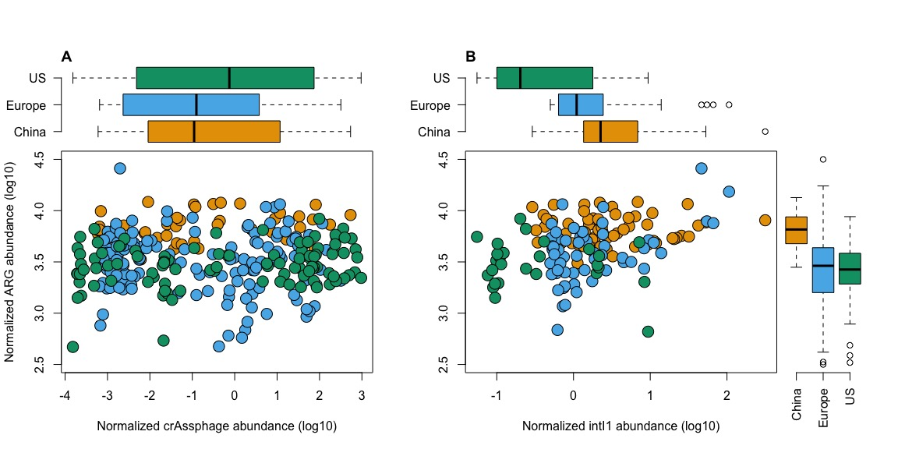
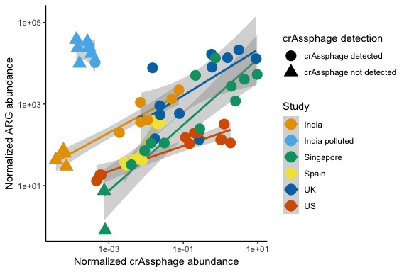
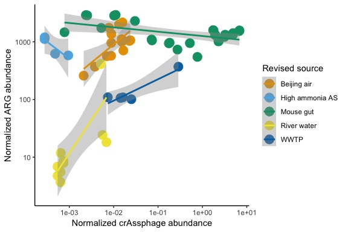
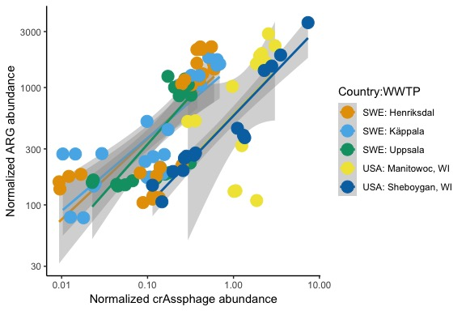

crAssphage project
================

-   [Background](#background)
    -   [Introduction](#introduction)
-   [Bioinformatics](#bioinformatics)
    -   [Phage genomes and Bowtie index](#phage-genomes-and-bowtie-index)
    -   [Mapping reads against phage genomes and calculating genome coverage](#mapping-reads-against-phage-genomes-and-calculating-genome-coverage)
    -   [ARG and MGE abundance](#arg-and-mge-abundance)
-   [Data analysis and statistics in R](#data-analysis-and-statistics-in-r)
    -   [Load in the data and libraries needed in the analyses](#load-in-the-data-and-libraries-needed-in-the-analyses)
    -   [Figure 1 - crAssphage and ARG dynamics in human feacal metagenomes](#figure-1---crassphage-and-arg-dynamics-in-human-feacal-metagenomes)
    -   [Figure 2 - Industrially polluted sediment is a hotspot for ARG selection](#figure-2---industrially-polluted-sediment-is-a-hotspot-for-arg-selection)
    -   [Figure 3 - ARG abundance is largely explained by fecal matter, not selection](#figure-3---arg-abundance-is-largely-explained-by-fecal-matter-not-selection)
    -   [Predicting antibiotic resistance gene abundance with crAssphage](#predicting-antibiotic-resistance-gene-abundance-with-crassphage)
    -   [Figure 4 - Antibiotic resistance gene dynamics in waste water treatment plants](#figure-4---antibiotic-resistance-gene-dynamics-in-waste-water-treatment-plants)
    -   [Estimated resistance risk correlates with fecal pollution](#estimated-resistance-risk-correlates-with-fecal-pollution)
    -   [Supplementary figures](#supplementary-figures)
-   [References](#references)

**The document is still under construction...**

Background
==========

Supplementary data analysis for the paper:

***Karkman, A., Pärnänen, K., Larsson, DGJ.*** 2018. Fecal pollution explains antibiotic resistance gene abundances in anthropogenically impacted environments. *Nature Communications* X: XYZ. DOI: [10.1038/s41467-018-07992-3](https://doi.org/10.1038/s41467-018-07992-3)

Introduction
------------

Discharge of treated sewage introduces antibiotic resistance genes (ARGs) and resistant bacteria (ARBs) to the environment (Karkman et al. 2018). It has been speculated that the resistance determinants could be selected and/or disseminated to other bacteria in the downstream environments due to the antibiotcs and other selective agents released in the effluents (Rizzo et al. 2013; Guo et al. 2017). However, the increased abundance of ARGs in downstream environments could as well be explained by the amount of fecal pollution without any large scale selection and/or dissemination of the genes.

Recently a human feacal phage, crAssphage, was discovered from human fecal metagenomes (Dutilh et al. 2014) and was shown to infect *Bacteroides intestinalis* (Shkoporov et al. 2018). It has been shown to be very abundant in human fecal material and mostly specific to humans (García-Aljaro et al. 2017). Due to these facts, it has already been used as fecal marker in various studies (Stachler et al. 2018; Ahmed, Zhang, et al. 2018; Stachler and Bibby 2014; Stachler et al. 2017; Ahmed, Lobos, et al. 2018). Another fecal Bacteroides phage, ɸB124-14, has also been used for microbial source tracking. Unlike crAssphage, it should be abundant in porcine and bovine guts as well (Ogilvie et al. 2017). However, we did not find it to perform as well as crAssphage and it won't be included in the analyses.

In this study we show that in most of the the studied environments the abundance of ARGs, *intI1* integrase gene and mobile genetic elements correlates well with fecal pollution levels with no evident signs of selection or dissemination of the resistance genes. The only exception being sediments polluted with wastewater from drug manufacturing containing exceptionally high levels of antibiotics (Bengtsson-Palme et al. 2014; Kristiansson et al. 2011).

**This supplementary data analysis file is meant to document the analyses. For more detailed information about the background, methods, results and conclusions we of course recommend the original article.**

Bioinformatics
==============

The bioinformartics part shows only example commands and is not meant to be run as such. The results from the bioinformatics part are available in the `data` folder and will be used in the data analysis part with R.

All metagenomic samples were downloaded from public repositories as described in the methods.

The crAssphage ([NC\_024711.1](https://www.ncbi.nlm.nih.gov/nuccore/NC_024711.1)) and ɸB124-14 ([HE608841.1](https://www.ncbi.nlm.nih.gov/nuccore/HE608841.1)) genomes were downloaded from GenBank as fasta files.

Phage genomes and Bowtie index
------------------------------

The phage genomes were indexed using `bowtie2-build`

``` bash
bowtie2-build phage_genome.fasta phage_genome
```

Mapping reads against phage genomes and calculating genome coverage
-------------------------------------------------------------------

After indexing the phage genomes each sample was mapped against the genomes. The average genome coverage was used as a proxy for phage abundance.
**Paired-end reads:**

``` bash
bowtie2 -x phage_genome -1 SampleX_R1_reads.fastq.gz -2 SampleX_R2_reads.fastq.gz -S SampleX.sam
samtools view -Sb -f 2 SampleX.sam > SampleX.bam
samtools sort SampleX.bam -o SampleX_sort.bam
samtools index SampleX_sort.bam
export GEN_COV=$(samtools depth -a SampleX_sort.bam |\
                  awk '{ sum += $3; n++ } END { if (n > 0) print sum / n; }')
echo 'SampleX\t'$GEN_COV
```

**Single reads:**

``` bash
bowtie2 -x phage_genome -U SampleY.fastq -S SampleY.sam
samtools view -Sb -q 10 SampleY.sam > SampleY.bam
samtools sort  SampleY.bam -o  SampleY_sort.bam
samtools index SampleY_sort.bam
export GEN_COV=$(samtools depth -a SampleY_sort.bam |\
                  awk '{ sum += $3; n++ } END { if (n > 0) print sum / n; }')
echo 'SampleY\t'$GEN_COV 
```

ARG and MGE abundance
---------------------

The `fastq` files were converted to `fasta`. The sample name was added to each sequence header before concatenating all fasta files to one file for annotation with DIAMOND against the [ARG](https://bitbucket.org/genomicepidemiology/resfinder_db) and [MGE](https://github.com/KatariinaParnanen/MobileGeneticElementDatabase) databases.

The count tables are generated from the DIAMOND outputs using custom scripts. The scripts for single (`parse_diamond.py`) and paired-end reads (`parse_diamondPE.py`) can be downloaded from my other [Github repository](https://github.com/karkman/parse_diamond).

**Paired-end reads:**

``` bash
diamond blastx -d ResFinder -q SampleX_R1.fasta --max-target-seqs 1 -o SampleX_R1_res.txt \
                -f 6 --id 90 --min-orf 20 -p 24 --masking 0
diamond blastx -d ResFinder -q SampleX_R2.fasta --max-target-seqs 1 -o SampleX_R2_res.txt \
                -f 6 --id 90 --min-orf 20 -p 24 --masking 0
python parse_diamondPE.py -1 SampleX_R1_res.txt -2 SampleX_R2_res.txt -o SampleX_ResFinder.csv
```

**Single reads:**

``` bash
diamond blastx -d ResFinder -q SampleY.fasta --max-target-seqs 1 -o SampleY_res.txt \
                -f 6 --id 90 --min-orf 20 -p 24 --masking 0
python parse_diamondPE.py -i SampleY_res.txt -o SampleY_ResFinder.csv
```

To bp count in each metagenome was used for normalization.

Data analysis and statistics in R
=================================

The results from mapping against crAssphage and the gene annotations were imported to R and combined in data frames. Resulting data frames for each part of te study can be found from the `data`folder.

Load in the data and libraries needed in the analyses
-----------------------------------------------------

Both `tidyverse` and `vegan` packageds are needed for the analyses (they can be installed with `install.packages()`).
In here the results are read to R and the colors used in the figures are defined.

``` r
library(tidyverse)
library(vegan)

cols <- c("#E69F00", "#56B4E9", "#009E73", "#F0E442", "#0072B2", "#D55E00", "#CC79A7")

HMP <- read.table("data/HMP.txt")
crass_impact <- read.table("data/crass_impact.txt")
MG_RAST <- read.table("data/MG-RAST.txt")
crass_wwtp <- read.table("data/crass_wwtp.txt")
res_risk <- read.table("data/res_risk.txt")
```

Figure 1 - crAssphage and ARG dynamics in human feacal metagenomes
------------------------------------------------------------------

The first figure shows the correlation between crAssphage and ARGs and *intI1* integrase gene in human fecal metagenomes in different populations.

``` r
par(fig=c(0,0.45,0,0.8), new=TRUE)
plot(log10(rel_res)~log10(rel_crAss), data=HMP, bg=cols[as.factor(HMP$country)], pch=21,
     ylab = "Normalized ARG abundance (log10)", 
     xlab="Normalized crAssphage abundance (log10)", cex=2, ylim=c(2.5, 4.5))

par(fig=c(0,0.45,0.5,1), new=TRUE)
boxplot(log10(rel_crAss)~country, data=HMP, horizontal=TRUE, col=cols, axes=F)
axis(2, at=1:3, labels=c("China", "Europe", "US"), las=1)
title("A", adj = 0, line = 0)

par(fig=c(0.45,0.9,0,0.8), new=TRUE)
tmp <- subset(HMP, rel_int>0)
plot(log10(rel_res)~log10(rel_int), data=tmp, bg=cols[as.factor(tmp$country)], pch=21,
      ylab = "", xlab="Normalized intI1 abundance (log10)", cex=2, ylim=c(2.5, 4.5))

par(fig=c(0.45,0.9,0.5,1), new=TRUE)
boxplot(log10(rel_int)~country, data=tmp, horizontal=TRUE, col=cols, axes=F)
axis(2, at=1:3, labels=c("China", "Europe", "US"), las=1)
title("B", adj = 0, line = 0)

par(fig=c(0.8,1,0,0.8),new=TRUE)
boxplot(log10(rel_res)~country, data=HMP, col=cols, axes=F)
axis(1, at=1:3, labels=c("China", "Europe", "US"), las=3)
```



**Figure 1.** Abundance of antibiotic resistance genes, intI1 gene and crAssphage in human fecal metagenomes.

some text...

``` r
# STATISTICS FOR FIG. 1 here
crass_mod <- lm(log10(rel_res)~country+log10(rel_crAss), data=HMP)
summary(crass_mod)
```

    ## 
    ## Call:
    ## lm(formula = log10(rel_res) ~ country + log10(rel_crAss), data = HMP)
    ## 
    ## Residuals:
    ##      Min       1Q   Median       3Q      Max 
    ## -0.82305 -0.13730  0.02065  0.15526  0.92042 
    ## 
    ## Coefficients:
    ##                   Estimate Std. Error t value Pr(>|t|)    
    ## (Intercept)       3.832371   0.036734 104.328  < 2e-16 ***
    ## countryEuropean  -0.331988   0.041913  -7.921 5.47e-14 ***
    ## countryUS        -0.363815   0.044071  -8.255 5.91e-15 ***
    ## log10(rel_crAss)  0.003295   0.007420   0.444    0.657    
    ## ---
    ## Signif. codes:  0 '***' 0.001 '**' 0.01 '*' 0.05 '.' 0.1 ' ' 1
    ## 
    ## Residual standard error: 0.2447 on 282 degrees of freedom
    ##   (163 observations deleted due to missingness)
    ## Multiple R-squared:  0.2134, Adjusted R-squared:  0.2051 
    ## F-statistic: 25.51 on 3 and 282 DF,  p-value: 1.25e-14

``` r
int_mod <- lm(log10(rel_res)~country+log10(rel_int), data=HMP)
summary(int_mod)
```

    ## 
    ## Call:
    ## lm(formula = log10(rel_res) ~ country + log10(rel_int), data = HMP)
    ## 
    ## Residuals:
    ##      Min       1Q   Median       3Q      Max 
    ## -0.74900 -0.13778 -0.00554  0.12871  0.73835 
    ## 
    ## Coefficients:
    ##                 Estimate Std. Error t value Pr(>|t|)    
    ## (Intercept)      3.78587    0.03091 122.496  < 2e-16 ***
    ## countryEuropean -0.21379    0.04025  -5.311 4.15e-07 ***
    ## countryUS       -0.27632    0.05666  -4.876 2.88e-06 ***
    ## log10(rel_int)   0.06083    0.02896   2.100   0.0375 *  
    ## ---
    ## Signif. codes:  0 '***' 0.001 '**' 0.01 '*' 0.05 '.' 0.1 ' ' 1
    ## 
    ## Residual standard error: 0.2148 on 141 degrees of freedom
    ##   (304 observations deleted due to missingness)
    ## Multiple R-squared:  0.3042, Adjusted R-squared:  0.2894 
    ## F-statistic: 20.55 on 3 and 141 DF,  p-value: 4.174e-11

Figure 2 - Industrially polluted sediment is a hotspot for ARG selection
------------------------------------------------------------------------

Figure 2 shows the correlation between crAssphage and ARGs in impacted environments. The only environenmt where selection possibly is happening are the heavily polluted Indian sediments having therapeutic concemntrations of antibioitcs.

``` r
ggplot(crass_impact, aes(x=rel_crAss, y=rel_res, color=country)) + 
  geom_smooth(method="lm") + 
  geom_point(aes(shape=crAss_detection), size=5) + 
  scale_x_log10() + 
  scale_y_log10() + 
  theme_classic() +
  labs(y = "Normalized ARG abundance", x="Normalized crAssphage abundance", 
       color="Study", shape="crAssphage detection") + scale_colour_manual(values=cols)
```



**Figure 2.** Correlation between ARG abundance and crAssphage abundance in environments with 642 pollution from WWTPs, hospitals or drug manufacturing.

some text...

``` r
# Statistics for figure 2 here
impact_mod <- lm(log10(rel_res)~country+log10(rel_crAss), data=crass_impact)
summary(impact_mod)
```

    ## 
    ## Call:
    ## lm(formula = log10(rel_res) ~ country + log10(rel_crAss), data = crass_impact)
    ## 
    ## Residuals:
    ##      Min       1Q   Median       3Q      Max 
    ## -1.38795 -0.22124  0.02787  0.24639  1.15404 
    ## 
    ## Coefficients:
    ##                       Estimate Std. Error t value Pr(>|t|)    
    ## (Intercept)            3.99570    0.21579  18.517  < 2e-16 ***
    ## countryIndia polluted  2.38322    0.23584  10.105 2.10e-14 ***
    ## countrySingapore      -0.93755    0.22206  -4.222 8.64e-05 ***
    ## countrySpain          -0.76029    0.20643  -3.683 0.000508 ***
    ## countryUK             -0.21895    0.23083  -0.949 0.346778    
    ## countryUS             -1.41900    0.22595  -6.280 4.68e-08 ***
    ## log10(rel_crAss)       0.57113    0.05509  10.368 8.01e-15 ***
    ## ---
    ## Signif. codes:  0 '***' 0.001 '**' 0.01 '*' 0.05 '.' 0.1 ' ' 1
    ## 
    ## Residual standard error: 0.4702 on 58 degrees of freedom
    ## Multiple R-squared:  0.8215, Adjusted R-squared:  0.803 
    ## F-statistic: 44.48 on 6 and 58 DF,  p-value: < 2.2e-16

Figure 3 - ARG abundance is largely explained by fecal matter, not selection
----------------------------------------------------------------------------

In figure 3 the link between fecal pollution and ARG abundance was studied in MG-RAST metagenomes. Only part of the metagenomes were from human impacted environemnts, so all samples where crAssphage was not detected can be removed. Also samples that were the only representative from the environemnt where they came where removed.
The annotations in the resulting samples were manually curated ands revised.

``` r
MG_RAST_crass <- subset(MG_RAST, crAss!="NA")
MG_RAST_crass <- MG_RAST_crass[MG_RAST_crass$feature %in%
                                 levels(MG_RAST_crass$feature)[table(MG_RAST_crass$feature)>2],]

MG_RAST_crass$revised_source <- "WWTP"
MG_RAST_crass[MG_RAST_crass$project_id=="mgp9679",]$revised_source <- "High ammonia AS"
MG_RAST_crass[MG_RAST_crass$project_id=="mgp9798",]$revised_source <- "High ammonia AS"
MG_RAST_crass[MG_RAST_crass$project_id=="mgp6153",]$revised_source <- "Mouse gut"
MG_RAST_crass[MG_RAST_crass$project_id=="mgp6698",]$revised_source <- "Mouse gut"
MG_RAST_crass[MG_RAST_crass$project_id=="mgp3907",]$revised_source <- "Mouse gut"
MG_RAST_crass[MG_RAST_crass$project_id=="mgp3190",]$revised_source <- "River water"
MG_RAST_crass[MG_RAST_crass$project_id=="mgp3756",]$revised_source <- "Beijing air"

ggplot(MG_RAST_crass, aes(x=rel_crAss, y=rel_res, color=revised_source)) + 
  geom_point(size=5) + 
  scale_x_log10() + 
  scale_y_log10() + 
  geom_smooth(method="lm") + 
  theme_classic() +
  labs(y = "Normalized ARG abundance", x="Normalized crAssphage abundance", 
       color = "Revised source") + scale_colour_manual(values=cols)
```



**Figure 3.** The correlation between crAssphage abundance and total ARG abundance in MG-RAST 651 metagenomes where crAssphage was detected.

Predicting antibiotic resistance gene abundance with crAssphage
---------------------------------------------------------------

some text here.

``` r
# And the model here
```

Figure 4 - Antibiotic resistance gene dynamics in waste water treatment plants
------------------------------------------------------------------------------

``` r
ggplot(crass_wwtp, aes(rel_crAss, rel_res, color=country_wwtp)) + 
  geom_smooth(method="lm") + 
  geom_point(size=5) + 
  scale_x_log10() + 
  scale_y_log10() + 
  theme_classic() + 
  scale_colour_manual(values=cols) + 
  labs(y = "Normalized ARG abundance", x="Normalized crAssphage abundance", 
       color="Country:WWTP")
```



**Figure 4.** ARG and crAssphage abundance in two US and three Swedish waste water treatment 658 plants showing similar correlation with different base level of resistance.

some text...

``` r
# And the statistics for fig 4 here
wwtp_mod <- lm(log10(rel_res)~country+log10(rel_crAss), data=crass_wwtp)
summary(wwtp_mod)
```

    ## 
    ## Call:
    ## lm(formula = log10(rel_res) ~ country + log10(rel_crAss), data = crass_wwtp)
    ## 
    ## Residuals:
    ##     Min      1Q  Median      3Q     Max 
    ## -0.9168 -0.1962  0.0885  0.2079  0.5715 
    ## 
    ## Coefficients:
    ##                  Estimate Std. Error t value Pr(>|t|)    
    ## (Intercept)       3.25786    0.06297  51.739  < 2e-16 ***
    ## countryUS        -0.49316    0.08295  -5.945 4.45e-08 ***
    ## log10(rel_crAss)  0.70270    0.05939  11.832  < 2e-16 ***
    ## ---
    ## Signif. codes:  0 '***' 0.001 '**' 0.01 '*' 0.05 '.' 0.1 ' ' 1
    ## 
    ## Residual standard error: 0.2979 on 96 degrees of freedom
    ## Multiple R-squared:  0.5975, Adjusted R-squared:  0.5891 
    ## F-statistic: 71.26 on 2 and 96 DF,  p-value: < 2.2e-16

Estimated resistance risk correlates with fecal pollution
---------------------------------------------------------

some text here...

``` r
# and analyses here
```

Supplementary figures
---------------------

some text...

``` r
# and all the figures here
```

References
==========

Ahmed, Warish, Aldo Lobos, Jacob Senkbeil, Jayme Peraud, Javier Gallard, and Valerie J. Harwood. 2018. “Evaluation of the Novel crAssphage Marker for Sewage Pollution Tracking in Storm Drain Outfalls in Tampa, Florida.” *Water Research* 131 (March): 142–50. <https://doi.org/10.1016/j.watres.2017.12.011>.

Ahmed, Warish, Qian Zhang, Aldo Lobos, Jacob Senkbeil, Michael J. Sadowsky, Valerie J. Harwood, Nazanin Saeidi, Oswald Marinoni, and Satoshi Ishii. 2018. “Precipitation Influences Pathogenic Bacteria and Antibiotic Resistance Gene Abundance in Storm Drain Outfalls in Coastal Sub-Tropical Waters.” *Environment International* 116 (July): 308–18. <https://doi.org/10.1016/j.envint.2018.04.005>.

Bengtsson-Palme, Johan, Fredrik Boulund, Jerker Fick, Erik Kristiansson, and D. G. Joakim Larsson. 2014. “Shotgun Metagenomics Reveals a Wide Array of Antibiotic Resistance Genes and Mobile Elements in a Polluted Lake in India.” *Frontiers in Microbiology* 5 (December): 648. <https://doi.org/10.3389/fmicb.2014.00648>.

Dutilh, Bas E., Noriko Cassman, Katelyn McNair, Savannah E. Sanchez, Genivaldo G. Z. Silva, Lance Boling, Jeremy J. Barr, et al. 2014. “A Highly Abundant Bacteriophage Discovered in the Unknown Sequences of Human Faecal Metagenomes.” *Nature Communications* 5: 4498. <https://doi.org/10.1038/ncomms5498>.

García-Aljaro, Cristina, Elisenda Ballesté, Maite Muniesa, and Juan Jofre. 2017. “Determination of crAssphage in Water Samples and Applicability for Tracking Human Faecal Pollution.” *Microbial Biotechnology* 10 (6): 1775–80. <https://doi.org/10.1111/1751-7915.12841>.

Guo, Jianhua, Jie Li, Hui Chen, Philip L. Bond, and Zhiguo Yuan. 2017. “Metagenomic Analysis Reveals Wastewater Treatment Plants as Hotspots of Antibiotic Resistance Genes and Mobile Genetic Elements.” *Water Research* 123 (October): 468–78. <https://doi.org/10.1016/j.watres.2017.07.002>.

Karkman, Antti, Thi Thuy Do, Fiona Walsh, and Marko P.J. Virta. 2018. “Antibiotic-Resistance Genes in Waste Water.” *Trends in Microbiology* 26 (3): 220–28. <https://doi.org/10.1016/j.tim.2017.09.005>.

Kristiansson, Erik, Jerker Fick, Anders Janzon, Roman Grabic, Carolin Rutgersson, Birgitta Weijdegård, Hanna Söderström, and D. G. Joakim Larsson. 2011. “Pyrosequencing of Antibiotic-Contaminated River Sediments Reveals High Levels of Resistance and Gene Transfer Elements.” Edited by Francisco Rodriguez-Valera. *PLoS ONE* 6 (2): e17038. <https://doi.org/10.1371/journal.pone.0017038>.

Ogilvie, Lesley A., Jonathan Nzakizwanayo, Fergus M. Guppy, Cinzia Dedi, David Diston, Huw Taylor, James Ebdon, and Brian V. Jones. 2017. “Resolution of Habitat-Associated Ecogenomic Signatures in Bacteriophage Genomes and Application to Microbial Source Tracking.” *The ISME Journal*, December. <https://doi.org/10.1038/s41396-017-0015-7>.

Rizzo, L., C. Manaia, C. Merlin, T. Schwartz, C. Dagot, M.C. Ploy, I. Michael, and D. Fatta-Kassinos. 2013. “Urban Wastewater Treatment Plants as Hotspots for Antibiotic Resistant Bacteria and Genes Spread into the Environment: A Review.” *Science of the Total Environment* 447 (March): 345–60. <https://doi.org/10.1016/j.scitotenv.2013.01.032>.

Shkoporov, Andrey N., Ekaterina V. Khokhlova, C. Brian Fitzgerald, Stephen R. Stockdale, Lorraine A. Draper, R. Paul Ross, and Colin Hill. 2018. “ΦCrAss001 Represents the Most Abundant Bacteriophage Family in the Human Gut and Infects Bacteroides Intestinalis.” *Nature Communications* 9 (1): 4781. <https://doi.org/10.1038/s41467-018-07225-7>.

Stachler, Elyse, Benay Akyon, Nathalia Aquino de Carvalho, Christian Ference, and Kyle Bibby. 2018. “Correlation of crAssphage qPCR Markers with Culturable and Molecular Indicators of Human Fecal Pollution in an Impacted Urban Watershed.” *Environmental Science & Technology* 52 (13): 7505–12. <https://doi.org/10.1021/acs.est.8b00638>.

Stachler, Elyse, and Kyle Bibby. 2014. “Metagenomic Evaluation of the Highly Abundant Human Gut Bacteriophage CrAssphage for Source Tracking of Human Fecal Pollution.” *Environmental Science & Technology Letters* 1 (10): 405–9. <https://doi.org/10.1021/ez500266s>.

Stachler, Elyse, Catherine Kelty, Mano Sivaganesan, Xiang Li, Kyle Bibby, and Orin C. Shanks. 2017. “Quantitative CrAssphage PCR Assays for Human Fecal Pollution Measurement.” *Environmental Science & Technology* 51 (16): 9146–54. <https://doi.org/10.1021/acs.est.7b02703>.
